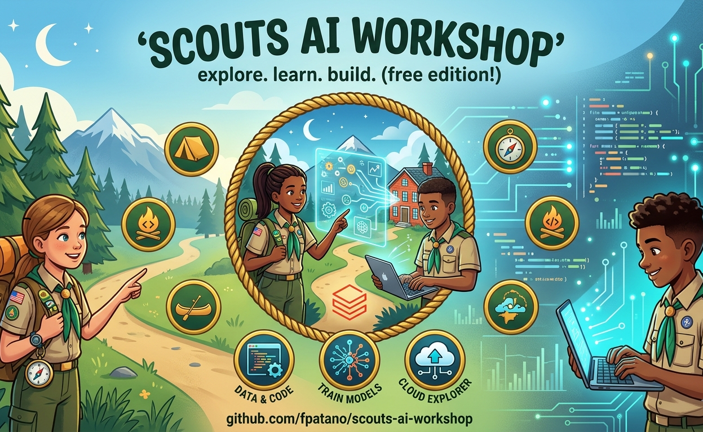

# Scouts BSA AI Merit Badge Workshop



[Short link to this repo](https://tinyurl.com/scoutsai)
tinyurl.com/scoutsai

[Sign up for Databricks Free](https://tinyurl.com/databricksfree)
tinyurl.com/databricksfree

A hands-on, 1-hour workshop that teaches AI concepts using Databricks Free Edition and Pokemon data.

## What Scouts Will Learn

- What AI, machine learning, and models actually are
- How to use AI functions (classify, summarize, query) on real data
- Prompt engineering: how to write instructions that get good results
- AI ethics: bias, deepfakes, and responsible use

## Merit Badge Requirements Covered

| Req | Topic | Where |
|-----|-------|-------|
| 1 | Key AI Concepts | Part 1 of lab notebook |
| 2 | AI Basics | Parts 1-2 of lab notebook |
| 4 | Ethics | Part 4 of lab notebook + handout |
| 6 | Prompt Engineering | Part 3 of lab notebook |
| 7 | Practical Application | Parts 2, 3, 5 of lab notebook |

## Workshop Structure

| Time | Duration | Activity |
|------|----------|----------|
| 0:00 | 10 min | Welcome, sign into Databricks Free Edition |
| 0:10 | 5 min | Run 00_setup notebook |
| 0:15 | 40 min | 01_pokemon_ai_lab (Parts 1-4) |
| 0:55 | 5 min | Wrap-up, take-home handout |

## Prerequisites

Each Scout needs:
- A laptop with a web browser
- A Databricks Free Edition account: https://signup.databricks.com
- That's it. No installs, no downloads.

## Instructor Setup

1. Make this repo public on GitHub
2. Each Scout: Workspace > New > Git Folder > paste the repo URL
3. Scout opens `notebooks/00_setup.py` and clicks Run All
4. The setup notebook auto-detects whether data is in a Volume or workspace files
5. Each Scout opens '01_pokemon_ai_lab' and reads and executes each cell by clicking the play button in the top right corner of each notebook cell. 

## Repo Structure

```
scouts-ai-workshop/
  data/pokemon.csv          Pre-cleaned Pokemon data (Gen 1-3, 389 rows)
  notebooks/
    00_setup.py             Run once to load data (2 min)
    01_pokemon_ai_lab.py    THE workshop - all 5 parts in one notebook
  setup/
    deploy_to_workspace.py  Instructor deployment script
    requirements.txt        Python dependencies for deploy script
    .env.example            Template for Databricks credentials
  INSTRUCTOR_GUIDE.md       Timing, talking points, troubleshooting
  HANDOUT.md                Printed take-home for Scouts
```

## Platform: Databricks Free Edition

| Resource | Limit | Impact |
|----------|-------|--------|
| SQL warehouse | 1x 2X-Small | Keep AI function queries to <10 rows |
| Compute | Serverless only | Python + SQL only |
| Internet | Trusted domains | CSV ships in-repo, no downloads needed |

## Data

389 Pokemon from Generations 1-3 with 18 columns: stats, types, abilities, catch rate, height, weight, legendary status. Clean column names (no spaces, no backticks needed).
